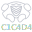

    

# Legal

C1C4D4 was developed purely for academic purposes to explore the feasibility of an experimental protocol. **C1C4D4 is not a service, nor does it provide one.**

Each user is expected to comply with any legal requests in their respective jurisdictions to remove harmful, illegal, or deceptive posts.

## Pre-rant

Most 'decentralised' platforms like: Mastodon, Lemmy, Bluesky, Matrix, Nostr and a thousand others are actually secretly federated. This is because it solves a lot of problems that p2p systems have, however, they normally accidentally end up being heavily centralised around their main instance. Even blockchain technology is still non-ideal, which requires users to spend money to use their service.

The closest we have is Scuttlebutt, which still relies on self hosted rooms (although for good reason I would add). Instead, I wanted a **true** decentralised protocol that is imperfect but works. 

This is my solution in a bucket of a thousand (a true 927 moment), but I hope that it serves it's purpose and grows into something I could be proud of, or to at least inspire a better solution.

# Protocol

1. Alice will receive a post from Bob via an bootstrap node.
2. If Alice believes that Bob is an acceptable peer, she will send a 'trust' request.
3. Bob accepts the request if Alice is similarly acceptable. 
4. The process repeats where Alice eventually finds her closest peers, and the bootstrap nodes are no longer needed.

TLDR: A friend of my friend is also my friend

By restricting how the users connect to one another, each node becomes a moderator for their peers. Unfortunately this does mean that everyone has a role to play in managing the worst of humanity, but by building the network and only connecting to trusted peers, this issue can be mitigated. 

# The main issue

To deal with NAT traversal, this project uses Iroh's [public relays](https://www.iroh.computer/docs/concepts/relay).

This is the weakest link in the chain, and means a couple things:
1. They have the ability to reject nodes from joining the network
2. If the relays go down, then no one can make any **new** connections with unknown peers

Currently, if Iroh misbehaves, people still have the option to host their own relays to participate in the network, but it's not an ideal situation to be in. Maybe the solution lies in tor? 🤔 

Only for this reason do I still consider C1C4D4 to be fully decentralised; C1C4D4 was always going to be an imperfect solution, but a solution nonetheless.

# What is guaranteed

1. Self-owned social media; full control your own recommendation algorithm with no 3rd party to influence what you see or don't see.

2. Extreme resilience; if there is even at least one copy of a post on the network, it can be replicated to everyone in seconds

3. End to end encryption to your trusted peers

4. No large easy targets for hackers or foreign governments to manipulate or take down.

5. Scalability - reach an audience of your 10 friends, or to thousands of viewers.

